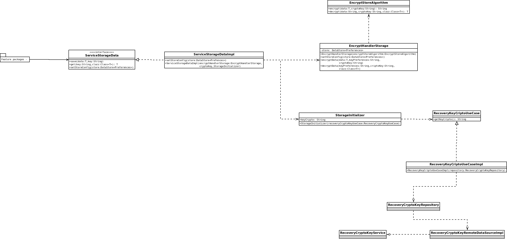

# SecurityStorageAndroidApp
Exemplo de como salvar dados no android de maneira segura utilizando algoritmos de criptografia e obtendo chave de segurança a partir de um backend. 

## Ofuscação de dados no arquivo de preferencias do android;

## Diagrama de Classes

